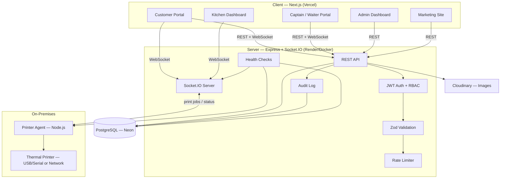
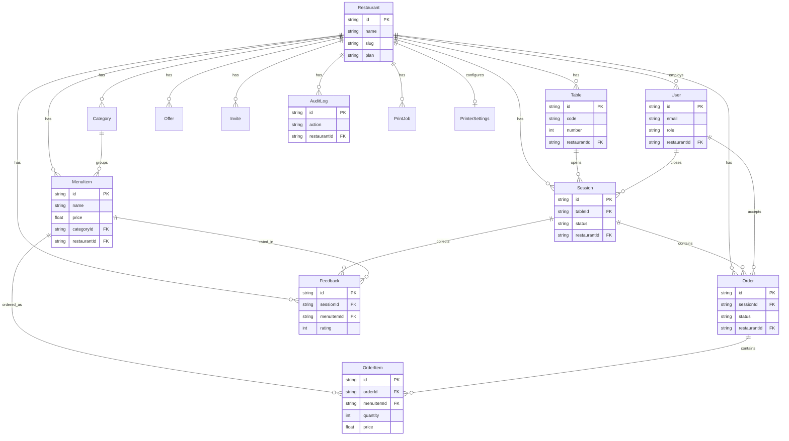

# ServeSync

**Restaurant QR Ordering & Management Platform** — a multi-tenant SaaS that lets a restaurant run its entire front-of-house on a QR code: guests browse the menu and order from their table, captains and kitchen staff coordinate in real time, and owners manage everything from a single dashboard.

Currently powering a live demo restaurant, **Sree Nookambika Family Dhaba**, end to end.

---

## Table of Contents

- [Overview](#overview)
- [Features](#features)
- [Tech Stack](#tech-stack)
- [Architecture](#architecture)
- [Database Schema](#database-schema)
- [Multi-Tenant Model](#multi-tenant-model)
- [QR Ordering Flow](#qr-ordering-flow)
- [AI Copilot](#ai-copilot)
- [Printing Setup](#printing-setup)
- [Getting Started](#getting-started)
- [Environment Variables](#environment-variables)
- [Testing](#testing)
- [Deployment](#deployment)
- [Documentation](#documentation)
- [Demo Access](#demo-access)

---

## Overview

ServeSync replaces a restaurant's paper menus, order slips, and manual billing with one connected system:

- A guest scans the QR code on their table, browses the live menu, and places an order — no app install, no login.
- The kitchen sees new orders the instant they're placed, over a live Socket.IO connection.
- Captains manage tables, accept orders, and close out bills.
- Admins run the whole restaurant — menu, staff, tables, offers, analytics, and an AI copilot that answers plain-English questions about the business.
- A local **Printer Agent** bridges the cloud backend to a physical thermal printer in the restaurant, printing KOTs (kitchen order tickets) and customer bills automatically.

The platform is multi-tenant: every restaurant that signs up gets its own isolated menu, staff, tables, and data, all served from the same deployment.

## Features

**Customer Portal** (no login required)
- QR-code table scanning to start an ordering session
- Live menu with categories, images, veg/non-veg badges, and offers
- Cart, order placement, and live order-status tracking
- Post-meal feedback and ratings per item
- Bill request and a branded thank-you screen

**Captain / Waiter Portal**
- Live incoming-order queue with accept/reject
- Table status overview and bill-request handling
- Session close-out with computed bill totals

**Kitchen Dashboard (KDS)**
- Real-time aggregated order feed across all tables
- Per-item status updates (preparing → ready)
- Automatic KOT printing via the Printer Agent

**Admin Dashboard**
- Menu & category management with Cloudinary image uploads
- Table management and bulk/individual QR regeneration
- Staff invites and account management (role-based: Admin / Manager / Captain / Kitchen)
- Offers & promotions
- Analytics: revenue trend, peak hours, top sellers, table & waiter performance
- **AI Copilot** — ask business questions in plain English, get answers grounded in real restaurant data
- Printer settings, discovery, live queue, and test printing
- Restaurant settings & branding
- Audit log of every sensitive action (menu edits, staff changes, QR regen, bill generation, ...)

**Public Marketing Site**
- Landing page, pricing, features, FAQ, contact, and a self-serve restaurant onboarding flow
- SEO-optimized (sitemap, robots.txt, Open Graph/Twitter cards, structured metadata)

**Platform-Wide**
- Multi-tenant data isolation
- JWT authentication with role-based access control
- Rate limiting tuned to real restaurant traffic patterns
- Structured audit logging
- Health checks for the API, database, Socket.IO, and Printer Agent
- PWA support (installable, offline fallback, splash screens)

## Tech Stack

| Layer | Technology |
|---|---|
| Frontend | Next.js 16 (App Router, Turbopack), React 19, TypeScript, Tailwind CSS 4 |
| Frontend extras | React Compiler (auto-memoization), Framer Motion, Recharts, Socket.IO client |
| Backend | Node.js 22, Express 5 |
| Database | PostgreSQL (Neon, serverless) via Prisma ORM |
| Real-time | Socket.IO (order updates, KDS feed, printer status) |
| Auth | JWT (Bearer tokens), bcrypt password hashing |
| Validation | Zod |
| Image storage | Cloudinary |
| Printer Agent | Node.js, `serialport` (USB/serial) + raw TCP (network printers), ESC/POS |
| Security | Helmet, CORS allowlisting, rate limiting, input validation |
| Testing | Node's built-in test runner (`node:test`) |
| Containerization | Docker (multi-stage builds), Docker Compose |
| CI | GitHub Actions |

## Architecture



Each portal (Customer / Waiter / Kitchen / Admin) is one Next.js app with route-based access control — not separate deployments. The server is a single Express + Socket.IO process; the Printer Agent is a small, independently-deployable Node process that runs on a machine physically at the restaurant (see [Printing Setup](#printing-setup)).

## Database Schema



Every tenant-scoped model carries a `restaurantId` — the enforcement point for multi-tenant isolation (see below). Full schema: [`server/prisma/schema.prisma`](server/prisma/schema.prisma).

## Multi-Tenant Model

Every restaurant is a row in `Restaurant`, identified by a unique `slug` (e.g. `nookambika`). Every tenant-owned table — `User`, `Table`, `Category`, `MenuItem`, `Session`, `Order`, `Feedback`, `Offer`, `Invite`, `AuditLog`, `PrintJob` — carries a `restaurantId` foreign key.

- **Public/customer requests** resolve their tenant from the URL (`/api/restaurants/:slug/...`) or from an already-tenant-scoped resource (a `sessionId`, which was created under a specific restaurant).
- **Staff requests** resolve their tenant from the authenticated user's own `restaurantId` (`resolveStaffTenant` middleware) — a captain at Restaurant A can never see or act on Restaurant B's data, even with a valid token.
- Every Prisma query in a tenant-scoped controller filters by `restaurantId` — there is no cross-tenant query path.

## QR Ordering Flow

1. Each `Table` has a unique `code`, rendered into a QR code (and regenerable on demand, individually or in bulk, from the Admin Dashboard — regeneration invalidates the old code and is audit-logged).
2. Scanning the code opens `/table/:code` (or the tenant-scoped `/restaurant/:slug/table/:code`), which starts a `Session` — the guest's ordering window for that visit.
3. The guest browses the live menu, adds items to a cart, and places one or more `Order`s against that session.
4. Orders push over Socket.IO to the Kitchen Dashboard and Captain Portal instantly — no polling.
5. The kitchen updates item status as it prepares each dish; the guest sees live status.
6. The guest requests the bill; a captain closes the session, computing the final total from all non-cancelled orders (this also triggers KOT/bill printing via the Printer Agent, if configured) and logs a `bill.generated` audit entry.
7. The guest lands on a thank-you screen and can leave feedback per item.

## AI Copilot

The Admin Dashboard includes an "Ask AI" panel (`/api/admin/insights/ask`) that answers plain-English business questions — e.g. *"Which item sold the most this week?"* — grounded entirely in the restaurant's **own** data (no external LLM call): a lightweight intent-matching engine routes the question to real Prisma aggregations (top sellers, revenue trends, peak hours, table/waiter performance) and a keyword-based feedback classifier (no external sentiment API) summarizes comment sentiment. Every answer is computed from the tenant's actual orders, sessions, and feedback — never fabricated.

## Printing Setup

The **Printer Agent** (`printer-agent/`) is a small Node.js process installed on a machine physically at the restaurant (a back-office PC, a mini PC by the kitchen, etc.). It:

1. Connects **outbound** to the cloud backend over Socket.IO (no inbound ports need to be opened at the restaurant).
2. Authenticates with `PRINTER_AGENT_KEY` and joins its restaurant's room.
3. Receives print jobs (KOTs, customer bills) pushed from the backend in real time.
4. Renders them as ESC/POS byte sequences and sends them to the configured printer — either:
   - **USB/Serial** (`SerialPrinter.js`, via the `serialport` package) — for a physical thermal printer plugged into that machine, or
   - **Network** (`NetworkPrinter.js`, raw TCP) — for a network-connected thermal printer.
5. Queues jobs locally (`PrintQueue`) and retries on transient failure; reports live connection/printer status back to the backend, surfaced in the Admin Dashboard and `/api/health/printer`.

**Native install (recommended for a real USB printer):**
```bash
cd printer-agent
npm install
cp .env.example .env   # set BACKEND_URL and PRINTER_AGENT_KEY
npm start
```

**Docker:** `printer-agent/Dockerfile` builds a working image, but Docker containers can't see a host's USB/serial devices without explicit device passthrough (straightforward on Linux with `--device`, awkward on Docker Desktop for macOS/Windows). The image is genuinely useful for **network printers** (pure TCP, no host device access needed), a Linux host/NAS with passthrough, or CI/local testing of the agent's non-hardware logic. For an actual USB thermal printer, install natively as above.

## Getting Started

### Prerequisites
- Node.js 22+
- A PostgreSQL database (e.g. a free [Neon](https://neon.tech) instance) — or use the bundled Postgres via Docker Compose
- A Cloudinary account (optional — only needed for image uploads)

### Option A — Docker Compose (fastest, full stack)

```bash
docker compose up --build
```

This starts Postgres, the API server, and the Next.js client together. Client: `http://localhost:3000`, API: `http://localhost:4000`. See [`docker-compose.yml`](docker-compose.yml) for the defaults (local dev credentials — never used in production).

### Option B — Run each service natively

```bash
# 1. Server
cd server
npm install
cp .env.example .env        # fill in DATABASE_URL, JWT_SECRET, etc. — see below
npx prisma db push          # sync the schema to your database
npm run seed                # optional — seeds the demo restaurant + demo data
npm run dev                 # http://localhost:4000

# 2. Client (separate terminal)
cd client
npm install
cp .env.example .env.local  # or rely on the built-in localhost defaults
npm run dev                 # http://localhost:3000

# 3. Printer Agent (optional, separate terminal)
cd printer-agent
npm install
cp .env.example .env        # set BACKEND_URL
npm start
```

> This project uses `prisma db push` (not `migrate dev`) as its schema-sync workflow — no migration history is checked in.

## Environment Variables

**Server** (`server/.env`) — validated at startup via `src/config/validateEnv.js`:

| Variable | Required | Purpose |
|---|---|---|
| `DATABASE_URL` | Yes (fails to start without it) | PostgreSQL connection string |
| `JWT_SECRET` | Yes (fails to start without it) | Signs/verifies auth tokens — 32+ chars recommended |
| `CLOUDINARY_CLOUD_NAME` / `CLOUDINARY_API_KEY` / `CLOUDINARY_API_SECRET` | Recommended | Image uploads (menu items, logos) fail gracefully without them |
| `CLIENT_URL` | Recommended | Used for CORS allowlisting and links in generated content |
| `PRINTER_AGENT_KEY` | Recommended | Shared secret between server and Printer Agent (falls back to an insecure default if unset — always set your own) |
| `PORT` | No | Defaults to `4000` |

**Client** (`client/.env.local`) — baked into the browser bundle at build time:

| Variable | Required | Purpose |
|---|---|---|
| `NEXT_PUBLIC_API_URL` | Recommended | Falls back to the production API URL if unset |
| `NEXT_PUBLIC_SOCKET_URL` | Recommended | Falls back to the production Socket.IO URL if unset |
| `NEXT_PUBLIC_SITE_URL` | Recommended | Used for canonical/Open Graph metadata |

**Printer Agent** (`printer-agent/.env`):

| Variable | Required | Purpose |
|---|---|---|
| `BACKEND_URL` | Yes (exits without it) | The server's URL to connect to over Socket.IO |
| `PRINTER_AGENT_KEY` | Recommended | Must match the server's value |
| `PRINTER_PORT` | No | Serial port path (defaults to a common macOS USB path) |
| `PRINTER_BAUD_RATE` | No | Defaults to `9600` |
| `PRINTER_TARGET` | No | `ALL` \| `RECEIPT` \| `KOT` |
| `KITCHEN_MODE` | No | `LIVE` \| `NORMAL` |

## Testing

```bash
cd server
npm test   # node:test — validation schemas, ESC/POS byte formatting,
           # token hashing, feedback keyword classification
```

This is a **unit-test foundation** over pure, dependency-free logic — not full end-to-end coverage against a live database (this project shares one Neon instance across dev/demo with no isolated test database provisioned). See [`docs/DEVELOPER_GUIDE.md`](docs/DEVELOPER_GUIDE.md#testing) for the reasoning and what a fuller test suite would need.

## Deployment

CI (`.github/workflows/ci.yml`) runs on every push/PR to `main`: dependency install, Prisma schema validation, server tests, and client lint/typecheck/build — it **never deploys**. Deployment is a separate, deliberate step:

- **Server**: containerize with `server/Dockerfile` and deploy anywhere that runs a container (Render, Railway, Fly.io, a VM). Needs `DATABASE_URL` and `JWT_SECRET` at minimum.
- **Client**: `next.config.mjs` sets `output: "standalone"` for a minimal Docker image (`client/Dockerfile`), or deploy directly to Vercel. Remember `NEXT_PUBLIC_*` vars are baked in at **build** time.
- **Printer Agent**: native install on a machine at each restaurant (see [Printing Setup](#printing-setup)) — this one isn't deployed to the cloud.

## Documentation

- [`docs/API.md`](docs/API.md) — full REST API reference
- [`docs/DEVELOPER_GUIDE.md`](docs/DEVELOPER_GUIDE.md) — local setup details, conventions, testing strategy, common workflows
- [`docs/FOLDER_STRUCTURE.md`](docs/FOLDER_STRUCTURE.md) — annotated project layout

## Demo Access

The seeded demo restaurant is **Sree Nookambika Family Dhaba** (`nookambika`). All data under this account is demo content — clearly a single seeded restaurant, not real live customers.

| Role | Email | Password |
|---|---|---|
| Admin | `admin@nookambika.com` | `admin@123` |
| Captain | `captain@nookambika.com` | `captain@123` |
| Kitchen | `kitchen@nookambika.com` | `kitchen@123` |

> Demo credentials only — change or remove `server/prisma/seed.js` before using this project with real restaurant data.
